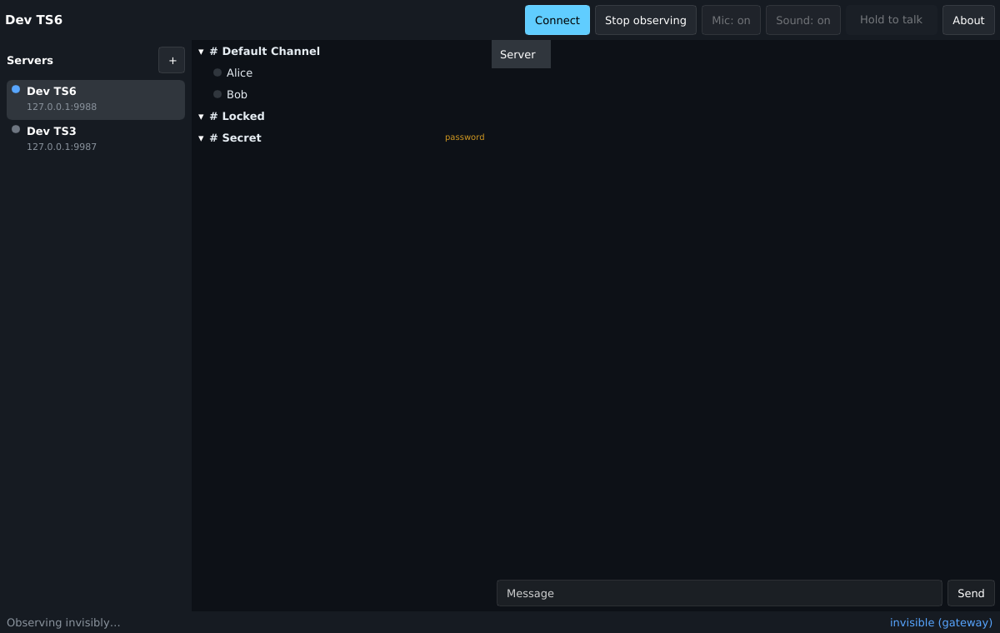

# teamspeak_client_rs

A TeamSpeak 3 / TeamSpeak 6 compatible voice client written in Rust, for desktop
(Linux Wayland/X11, Windows, later macOS) and mobile (Android, later iOS).

It speaks the TeamSpeak client protocol itself (no official SDK). The protocol
layer is a vendored fork of [ReSpeak/tsclientlib](https://github.com/ReSpeak/tsclientlib).

> Not affiliated with or endorsed by TeamSpeak Systems GmbH. "TeamSpeak" is a
> trademark of its owner; the product name of this client is still to be decided.

## Goals

| Feature | How |
|---|---|
| Global server chat | Native `sendtextmessage targetmode=3` |
| Chat in channels without joining their voice channel | Relay through invisible ServerQuery sessions (companion gateway `tsgw`, or own query credentials). The protocol only delivers channel chat for the channel you are in. |
| Voice | Opus over the TS3 UDP protocol, echo cancellation, jitter buffer |
| See who is in voice channels without joining | Channel subscriptions when connected; invisible presence through the gateway or own query credentials |
| Watch and share screen with sound | TeamSpeak 6 servers only: WebRTC peer-to-peer streams signalled through the server |

See [docs/architecture.md](docs/architecture.md) for the design and milestones.

## Status

Done so far (milestones M0–M4 and the first part of M5 of [the plan](docs/architecture.md#milestones)):

- `crates/proto/`: vendored tsclientlib, modernised (TS6 fields and stream
  messages, faster off-thread Init1 puzzle, `curve25519-dalek` 4, fuzzing fixes;
  see [UPSTREAM.md](crates/proto/UPSTREAM.md))
- `crates/tsc-model`: server flavor detection (TS3 / TS6) and capabilities
- `crates/tsc-audio`: Opus voice encoding, framing, resampling, WAV, jitter buffer/mixer, cpal devices
- `crates/tsc-store`: SQLite store for identities, bookmarks, settings and chat history; keyring secrets
- `crates/tsc-query`: ServerQuery client over raw TCP, SSH and HTTP WebQuery (events, rate limiting, keepalive)
- `crates/tsc-observer`: invisible presence (events or polling) and channel-chat relays over ServerQuery
- `crates/tsc-gateway` (`tsgw`) + `tsc-gateway-proto`: companion gateway for server admins. Users log in
  with their TeamSpeak identity and get presence, channel chat and history without joining voice,
  limited by their server permissions ([admin guide](docs/gateway-admin.md))
- `crates/tsc-core`: client engine; sessions merge voice, gateway and query sources, route chat, run audio;
  the media pipeline for streams (capture → VP8 + Opus → stream, stream → decoder)
- `crates/tsc-ui` (`tsc-desktop`): Slint desktop app: servers, channel tree with talking indicators,
  chat tabs (own channel via voice, other channels via relay), connect / observe invisibly, mute, push-to-talk
  (in the window and as a global hotkey), audio settings with a level meter, per-client volume, and on
  TeamSpeak 6 streams: watch in a viewer, share the screen with sound
- `crates/tsc-stream`: TeamSpeak 6 streams: stream commands and notifications, JSON signalling,
  WebRTC peers (str0m) with host and STUN candidates. A live test streams VP8 + Opus between two
  clients through a TS6 server
- `tools/tsctl`: headless CLI: channel tree, chat, voice send/record, raw commands, stream events,
  `query`, `observe` (invisible presence), `relay` (channel chat without joining) and `gateway`
- `dev/`: TeamSpeak 3.13 and TeamSpeak 6 (6.0.0-beta13.1) servers; `scripts/it-smoke.sh`
  checks tree, server chat, channel chat, a voice tone round-trip, invisible presence,
  relay chat and the gateway on both
- `fuzz/`: cargo-fuzz targets for packets, commands and the license chain
- `android/` + `crates/tsc-android`: the Android app (the same Slint UI in a NativeActivity,
  voice in a foreground service, screen sharing through MediaProjection, MediaCodec, Keystore
  passwords). It builds; it has not run on a device yet ([docs/android.md](docs/android.md))

Screen sharing works between our clients through a TeamSpeak 6 server (VP8 video, Opus audio);
interop with the official TeamSpeak 6 client is not verified yet.

| Connected with voice | Observing invisibly through the gateway |
|---|---|
|  |  |
| **Watching a stream** | **Sharing the screen** |
|  |  |

## Try it

```sh
# Desktop app
cargo run -p tsc-ui --bin tsc-desktop

# Local servers (use REGISTRY=mirror.gcr.io if Docker Hub rate-limits you)
docker compose -f dev/docker-compose.yml up -d

cargo run -p tsctl -- connect 127.0.0.1:9987 tree            # TeamSpeak 3
cargo run -p tsctl -- connect 127.0.0.1:9988 tree            # TeamSpeak 6
cargo run -p tsctl -- connect 127.0.0.1:9988 --nick me repl  # interactive chat
cargo run -p tsctl -- connect 127.0.0.1:9988 --nick me voice send --tone 440
cargo run -p tsctl -- connect 127.0.0.1:9988 --nick ear voice record out.wav

# Streams (TeamSpeak 6): share the test pattern (or --source x11), watch and decode it
cargo run -p tsctl -- connect 127.0.0.1:9988 --nick eye stream watch --save-frame shot.png &
cargo run -p tsctl -- connect 127.0.0.1:9988 --nick me stream start --synthetic --auto-accept

# ServerQuery (dev password tsc-dev-admin): invisible presence and relay chat
cargo run -p tsctl -- observe ssh 127.0.0.1:10022 --secret tsc-dev-admin --allowlisted
cargo run -p tsctl -- relay ssh 127.0.0.1:10022 --secret tsc-dev-admin --allowlisted --channel 1

# Gateway: users without voice, logging in with their identity
cargo run -p tsc-gateway -- --config dev/tsgw-ts6.toml &
cargo run -p tsctl -- gateway ws://127.0.0.1:7788/v1 --identity <file> --presence --open channel:1

scripts/it-smoke.sh   # all of the above, on both servers
```

Other commands: `tsctl identity new`, `tsctl versions`, `tsctl connect <addr> listen|chat|raw`.
`tsctl --help` lists all options.

Development switches of the desktop app (environment variables): `TSC_DATA_DIR` (database),
`TSC_AUTOCONNECT=voice|observe`, `TSC_SCREENSHOT=<png>` (with `TSC_SCREENSHOT_DELAY`),
`TSC_DEMO_STREAM=1` (a local test stream in the viewer, no server needed),
`TSC_OPEN=share|settings[:<tab>]|about|client`, `TSC_AUTOWATCH=1`, `TSC_AUTOSHARE=test-pattern`.

Ready-made packages (Linux `.tar.gz`/`.deb`/Flatpak, Windows zip and installer, Android APK)
come from every CI run, and `scripts/docker-build.sh` builds the same ones locally in Docker:
see [docs/building.md](docs/building.md).

Building on Linux needs the ALSA headers (`libasound2-dev`), fontconfig and xkbcommon
headers for the UI (`libfontconfig1-dev libxkbcommon-dev`), plus CMake and a C compiler for
the bundled libopus; for streams also libvpx and PipeWire (see [docs/media.md](docs/media.md#build-requirements)).

## License

The vendored crates in `crates/proto/` are `MIT OR Apache-2.0` (upstream
`LICENSE-MIT` / `LICENSE-APACHE` are kept there). New crates are declared under
the same terms in `Cargo.toml`.

Third-party notices: [THIRD_PARTY_NOTICES.md](THIRD_PARTY_NOTICES.md), generated from
`Cargo.lock` by `scripts/notices.sh` and shown in the app's About page. The UI toolkit,
Slint, is used under its royalty-free license, which requires an attribution in the
About page.

Security issues: see [SECURITY.md](SECURITY.md). Releases: [docs/release.md](docs/release.md).
