# The user interface

`crates/voelin-ui` is the Slint UI of the desktop app and of the Android app
(`crates/voelin-android` runs the same window). It uses Slint's software
renderer, the Inter font, Lucide icons and Twemoji; the look follows the
design mockups (deep navy panels, a blue accent, a server rail, a top bar, a
sidebar with the user card, an optional right panel).


## Structure

```
crates/voelin-ui/
  ui/
    app.slint            MainWindow: picks the shell, puts the page's screens in it, dialogs
    theme.slint          Theme global: design tokens (colours, radii, spacing, type)
    icons.slint          Icons global: Lucide icons (tint them with `Icon`)
    bridge.slint         structs, the Bridge global (data and callbacks for Rust),
                         Images (decoded images) and Emoji (the picker's data)
    nav.slint            Nav global: page, settings section, phone tab, dialogs, panel size
    studio-bridge.slint  the Stream Studio's structs and globals (StudioBridge, StudioNav)
    studio-window.slint  StudioWindow: the studio in a window of its own
    components/          the design system (catalogue below); index.slint exports all
    shells/              desktop.slint (rail, top bar, Sidebar), mobile.slint (bottom
                         navigation), common.slint (Panel, VoiceCard, UserCard, ...)
    screens/             channels, chat, members (panel, card), drawers (pins, topics),
                         voice (the voice channel), voice-parts (its people and
                         streams, also the phone's), streams (viewer; the phone's
                         panel), settings, settings-pages (its sections), home,
                         friends, messages (direct messages), events, overlays
                         (the bell, the search, a picture), dialogs, mobile and
                         mobile-voice (phone-only pages),
                         studio-parts (the studio's pieces), studio (its page, its
                         phone layout)
    assets/              fonts/ (Inter, OFL), icons/ (Lucide, ISC), logo.svg
  assets/twemoji.bin     the Twemoji SVGs packed by scripts/pack-twemoji.py
  src/
    app.rs               setup, App state, event dispatch
    servers.rs chat.rs members.rs streams.rs settings_page.rs appearance.rs
    home.rs social.rs messages.rs events.rs settings_pages.rs previews.rs
    studio.rs            the logic of each area (social.rs: contacts, the bell and the
                         search; previews.rs: pictures in chat; studio.rs: the Stream
                         Studio's controller)
    vm/                  pure view models (engine state → Slint structs), unit-tested
    bind/                callbacks of each area, wired once
    images.rs            the image cache (LRU, bounded by `ui.image_cache_mb`)
    emoji.rs             the Twemoji archive, text → runs of text and emoji
    dev.rs               development switches (screenshots, sample data)
```

Models are created once (`app::Models`) and updated row by row with
`vm::list::sync`, which keeps the rows shared at both ends and changes,
inserts or removes the rest: a client that starts talking changes one row of
the tree. Every chat tab owns a `VecModel` of its lines; the chat view shows
the selected tab's model, so a new message is one `push` and switching tabs
swaps the model. Lists that can grow (channels, messages, notices, the emoji
grid) use `ListView`, which builds only the visible rows.

## Theme tokens

`Theme` (ui/theme.slint) holds every colour and size; components never use
literal colours.

| Group | Tokens |
|---|---|
| Mode | `mode` ("dark", "light", "system"; set from `ui.theme`), `dark` (resolved), `font-scale` (from `ui.font_scale`) |
| Backgrounds | `bg-app`, `backdrop` (gradient), `bg-rail`, `surface` (panels), `surface-2` (cards, inputs), `surface-3` (hover, menus), `surface-4` (pressed), `scrim` (behind modals), `scrim-light` (behind pop-ups), `overlay` |
| Lines | `border`, `border-strong`, `border-popup` (pop-ups, menus, tooltips), `glow`, `glow-width` (focus/selection ring; the software renderer draws no shadows) |
| Accent | `accent`, `accent-hover`, `accent-pressed`, `accent-soft` (selected rows), `accent-soft-hover`, `accent-text` (links), `name-text` (chat authors), `on-accent` |
| States | `live`, `live-soft`, `danger`, `danger-soft`, `success`, `success-soft`, `warning`, `warning-soft`, `idle`, `dnd`, `offline`, `gold` (crown), `info` |
| Text | `text`, `text-secondary`, `text-muted`, `text-disabled`, `icon` |
| Meter | `meter-low` (green), `meter-mid` (yellow), `meter-high` (red), `meter-off` |
| Radii | `radius-xs` 4, `radius-sm` 6, `radius-md` 8, `radius-lg` 12, `radius-xl` 16, `radius-pill` |
| Spacing | `space-1` 2 … `space-8` 32 (2, 4, 8, 12, 16, 20, 24, 32) |
| Type (scaled) | `font-xs` 11, `font-sm` 12, `font-body` 14, `font-md` 15, `font-lg` 17, `font-xl` 20, `font-2xl` 24, `font-3xl` 30; `weight-regular` … `weight-bold` |
| Sizes | `row-height`, `control-height` 36, `control-height-sm` 28, `icon-sm/md/lg` 16/20/24, `rail-width` 72, `sidebar-width` 264 (grows with the font scale), `topbar-height` 44 (more when large text makes the controls taller), `right-panel-min` |
| Motion | `fast` 120 ms, `normal` 200 ms |

A light palette is filled in for every colour; `mode` switches at runtime.
The standard widgets (scroll bars, context menus) follow through
`Palette.color-scheme`.

## Components

All in `ui/components/`, exported by `components/index.slint`.

A component used in many places keeps `opacity`, `visible`, shadows and
animations off its root element: Slint inlines such a component at every
use, which grows the generated code and the compiler's memory (IconButton
puts them on an inner `face`).

| Component | File | Key properties |
|---|---|---|
| `Icon` | icon.slint | `source` (an `Icons.*`), `size`, `tint` |
| `Spinner` | icon.slint | `size`, `tint`, `running` |
| `Button` | button.slint | `text`, `icon`, `kind` (`ButtonKind.primary/secondary/danger/ghost`), `enabled`, `checked`, `small`; `clicked` |
| `IconButton` | button.slint | `icon`, `label` (screen readers), `tooltip` (default `label`, "" for none; on hover, also while disabled, desktop only), `checked`, `danger`, `alarm` (filled red with a white icon: Leave), `round`, `filled`, `edge` (the border of a filled one while not checked), `size`, `icon-size`, `tint`, `dot`, `count` (a neutral number at the top right, hidden at 0 or less); `clicked` |
| `ActionButton` | button.slint | round button with a caption (the phone's voice bar and You page: Mute, Deafen, Go Live, Leave), no tooltip: `icon`, `text`, `checked`, `danger`, `alarm`, `checkable` (screen readers hear `checked`), `size`, `icon-size`, `edge` |
| `FocusRing` | button.slint | the accent ring of focused controls |
| `TextField` | text-field.slint | `text`, `placeholder`, `input-type`, `icon`, `label`, `bare`, `read-only`; out `has-focus`, `text-height` (the height of its lines); `accepted`, `edited`, `key-pressed`; `clear()`, `select-all()`, `focus-end()` (the cursor after the text) |
| `SearchBox` | text-field.slint | a TextField with a magnifier and the Ctrl K hint (`show-shortcut`) |
| `Kbd` | text-field.slint | a key cap |
| `Field` | text-field.slint | `label` above a control (@children), `hint` below |
| `Select` | select.slint | drop-down: `model`, `current-index`, `current-value`, `icon`, `label`; `selected(string)` |
| `Toggle` | toggle.slint | the pill switch: `checked`, `label`; `toggled(bool)` |
| `ToggleRow` | toggle.slint | settings row: `icon`, `text`, `description`, `checked`; `toggled(bool)` |
| `RadioRow` | toggle.slint | `checked`, `text`, `description`, `icon`; `clicked` |
| `Slider` | slider.slint | `value`, `minimum`, `maximum`, `step`, `label`; `changed(float)` while dragging, `released(float)` |
| `SegmentedTabs` | tabs.slint | `model`, `current-index`, `label`; `selected(int)` |
| `TabItem` | tabs.slint | underlined tab: `text`, `selected`, `badge`, `closable`; `clicked`, `close` |
| `Avatar` | avatar.slint | `image` or `initials` + `tint` (one letter under 28 px, through `Images.first-letter`), `size`, `status` (`Status.online/idle/dnd/offline/info`), `speaking` (green ring), `crown`, `square` (server icons); a server icon at most half as wide (TeamSpeak's 16 px ones) is drawn at twice its size, sharp, on the tint (a person's picture always fills it) |
| `Art` | art.slint | a painted picture (`Icons.art-*`) covering `cover-width` × `cover-height` at its own aspect ratio, cut by the parent's clip; `align-x`, `align-y` (0 keeps the left or top edge, 1 the other); home's banner and cards, the stream cards |
| `CountBadge` | badge.slint | count bubble: `count`, `fill` (red), `ink` (the number) |
| `LiveBadge` | badge.slint | `text` (LIVE), `large` |
| `Chip` | badge.slint | tag: `text`, `icon`, `picture` (in its own colours, a badge's), `tint`, `fill`, `outlined` |
| `BadgeIcons` | badge.slint | up to three 14 px pictures after a name (`first`, `second`, `third`); empty ones take no room |
| `Dot` | badge.slint | a status dot |
| `Card` | card.slint | panel card with optional `title`, `icon`, `subtitle`, `selected`; `inset`, `gap` |
| `SectionHeader` | card.slint | `text`, `icon`, `count`, `action` ("See All >"), `small`; `action-clicked` |
| `Divider` | card.slint | horizontal line |
| `Banner` | card.slint | warning/error strip: `text`, `icon`, `tone`, actions as @children |
| `Meter` | meter.slint | segmented level meter: `level` (dBFS), `threshold`, `show-threshold`, `active`, `segments` |
| `SpeakingBars` | meter.slint | animated "speaking" bars |
| `NavItem` | list-item.slint | navigation entry: `icon`, `text`, `subtitle`, `selected`, `badge`, `chevron`; `clicked` |
| `ListItem` | list-item.slint | row with a leading slot (@children), `title`, `subtitle`, `trailing`, `selected` |
| `PopupMenu` | overlay.slint | themed menu: `entries` ([MenuEntry]), `show(x, y)`; `activated(int)` |
| `Tooltip` | overlay.slint | wraps @children; `text` shows at the pointer after a moment, until it leaves (desktop only: `Bridge.desktop`) |
| `HoverTooltip` | tooltip.slint | the same, put last in an element (as IconButton does): `text`; `pressed` and `hovered` of the element's TouchArea (a press closes it until the pointer leaves) |
| `TooltipBubble` | tooltip.slint | a tooltip's bubble: `text`, wrapping at `widest` (400px) |
| `Modal` | overlay.slint | dialog with backdrop: `title`, `subtitle`, `icon`, `card-width`, `card-height`; `dismissed` (backdrop, Escape, ×) |
| `Toast` | overlay.slint | `text`, `icon`, `timeout`, `shown` |
| `ResizeHandle` | overlay.slint | drag to resize a side panel: `size` (two-way), `minimum`, `maximum`, `left` |
| `RichText` | emoji.slint | text with formatting and inline emoji: `blocks` ([TextBlock]) of lines, quotes (a bar and the author), code (on a background), list items and rules; a block's `runs` ([TextRun]: bold, italic, underline, strike, code, the author's colour per theme, links underlined in the accent colour) flow and wrap in a FlexboxLayout; a click on a link opens it (`Nav.open-link`), a right-click shows Open link and Copy link |
| `MessageText` | emoji.slint | a message's text (`line`: ChatLine): one `Text` when it has neither formatting nor emoji, else a `RichText`; a note for a blocked contact's. The chat, the pins drawer and the studio's chat use it |
| `EmojiPicker` | emoji.slint | search, categories, virtualised grid; `picked(EmojiCell)`, `close` |
| `ListView`, `ScrollView` | std-widgets | re-exported (virtualised lists) |

Shell pieces (ui/shells/): `DesktopShell` (rail + top bar + panels as
@children), `Sidebar` (page navigation above the voice card and user card),
`Panel`, `ServerRail` (Home, the servers, Add a server, the settings; each
server shows its icon or its initials, on a colour no other server has while
there are at most ten, kept when a server is added),
`TopBar` (the search, starting over the main panel, opens the search like
Ctrl+K; the bell at the right), `MobileShell` (top bar, page, bottom
navigation), `VoiceCard`, `VoiceButtons` (mute, deafen, share; `gear` adds
the voice settings; `round` and `filled` for the voice view's call bar),
`UserCard` (its avatar and name open Settings → My Account), `HoldToTalk`.
Pages bring their own title; About is in the settings (and on the phone's
You page).

Voice parts (ui/screens/voice-parts.slint), for the desktop's voice view and
the phone's voice screen: `Participant` (`member`, `size`: the avatar's) and
`StreamCard` (`stream`), both with `compact`, the phone's smaller look (a
person ringed only while talking or streaming, LIVE below the name; a stream
as a row with the streamer's avatar). The protocol has no thumbnails (a
picture means joining the stream, which the streamer sees as a request), so
a stream card shows the stream only while we watch it, and our own from the
Stream Studio its preview while live; otherwise the streamer's avatar,
ringed, with what they share, on a painted scene in their colour.

## The server page

The server page follows the design mockups 03 to 08 (desktop). Each part
comes from the engine's events; what a gateway adds is hidden without it.

| Part | `VOELIN_OPEN` | What it shows | Engine data |
|---|---|---|---|
| Chat | `server` (`server:chat`: the server chat), `actions`, `link-confirm[:<url>]`, `unread[:end]` | Header with the channel's topic, then icon buttons for Pinned messages and Topics (each with its count once the gateway sent them: asked for when the chat is shown), the voice channel and the members; chat tabs (the server chat and channel chats; private chats are on the Direct Messages page); messages grouped by author ("Today at 10:14"), avatars, BBCode formatting (see Formatting below), emoji, reactions with an add button, pin and topic marks, file cards with download; composer with attach, emoji and send. A link opens in the browser; one whose text is not its address (a masked link) first shows where it goes in `LinkDialog` (the host, the whole address; Open, Copy link, Cancel); a TeamSpeak link opens in Voelin (Adding a server: Links, below); a right-click on a link offers Open link and Copy link. Every message has actions on hover (`MessageActions`; `actions` shows the last one's): Quote (`> Author: …` lines at the start of the composer, which takes the focus to write below them and grows to show up to about eight lines) and Copy text, and with a gateway quick reactions, pin and Start a topic; a right-click on a message shows Copy text, Copy link (its first web address), Quote, and with a gateway React… and Pin. The server chat starts with the server's welcome message (and its host message when the server puts it in the chat log). Opens at the newest message and follows new ones while at the end. Scrolling up to within a screen of the top loads the page before, above the rows on screen, which stay in place (a spinner above the oldest message while it loads). The Older messages button there is for a chat too short to scroll, and for after a page that brought nothing (scrolling loads again once the list was a screen away). The voice view, the phone's voice screen and private chats load the same way. Messages count as read while their chat is on screen in the focused window; the chat tabs and the server rail count the others (not our own; private chats count on Direct Messages). A chat that comes on screen with new messages, or that is on screen when messages that came while away arrive (a stored or gateway page), shows a red line with New above the first (`NewDivider`) until the chat is left; while that line is above the view, a bar over the list says how many are new and since when (`UnreadBar`: "5 new messages since 10:14", Jump, and × to mark them read). Where each chat was read is kept on this device (the store's `chat_reads`), so the counts survive a restart: messages that came while away (a gateway's history) count as new | `ChatHistory` (and `Chat` for servers without history), `Presence` (welcome and host message), `AvatarReady`, `Transfer`, `Gateway` (pins; reactions arrive as stored messages); `Command::LoadOlderHistory`, `DownloadChatFile`, `UploadFile`, `GatewayRequest::React`, `Unreact`, `Pin`, `Unpin` |
| Members panel | `server` (`panel`, `no-panel`) | "Members — N" and a search; those streaming first (the people in our channel while the voice channel or a stream is shown), then each server group in the server's order with its icon, then those without a group. Rows: avatar with status, name, crown (admin groups), priority speaker, channel commander, recording, up to three myTeamSpeak badges, moderator role, a hand when their channel needs more talk power than they have ("Needs talk power to speak"; the member card has the number), what they do or the channel they are in. Resizable: the width is `ui.members_width` | `Presence`, `Groups`, `Talking`, `IconReady`, `PictureReady` |
| Member card | `member` | Description, groups, badges (up to three chips in the client's order, what each is for on hover; "Badge" for one the app does not know), talk power, country; private message (on Direct Messages), poke, friend, block; volume and mute for us | `ContactsChanged`, `PictureReady` (badges); `Command::SetContact`, `SetClientVolume`, `SetClientMuted`, `Poke` |
| Poke | `poke` (the first other member's, card open; after `friends` a contact's) | `PokeDialog`, from the member card, a friend's row and the direct message header: an optional message with a "12/100" count, Send off above 100 characters, Enter sends, Escape cancels | `Command::Poke` (trimmed, cut to 100 characters; the engine cuts too) |
| Channel password | `channel-password`, `channel-password:wrong` | Joining a channel (a double-click in the tree, joining a friend) moves there with voice, or connects into it (by its id) without; when the server puts us elsewhere on connecting, as it does for a wrong password, it is joined again, which says why. A locked channel first asks for its password in `ChannelPasswordDialog`, unless one was given since voice connected; a refused one asks again under "Wrong password". A full channel or another refusal is a toast | `Presence` (`has_password`), `JoinFailed`; `Command::MoveToChannel`, `ConnectVoice` (`channel_password`) |
| Pinned messages | `pins` | In the members panel's place: cards with author, time, text, files and reactions; the pin unpins, a click jumps to the message | `Gateway` `Pins`, `Pinned`, `Unpinned`; `GatewayRequest::Pins`, `Unpin` |
| Topics | `topics`, `topic:<id>` | In the members panel's place: search, cards with the message count, creator and last activity, Create Topic; an open topic replaces the chat's messages and takes replies | `Gateway` `Topics`, `Topic`, `TopicHistory`; `GatewayRequest::Topics`, `TopicHistory`, `CreateTopic`, `Post` |
| Voice channel | `voice`, `voice:compact` | Title, topic, "5 in voice / 50 total", Copy invite link (a `ts3server://` link to the channel; the phone's Invite button does the same), the members button, Smaller stage / Larger stage, Chat only; the people as large avatars (talking ring and bars, muted, crown, streaming); the streams as cards (the streamer's avatar on a painted scene in their colour, or the picture while watched, and our own from the Stream Studio its preview: `studio:live,server,voice`; LIVE, viewers, kind, bitrate, sound, Watch Stream); the call bar: mute and deafen (red while on), share (its menu opens above it), the voice settings and Leave; the channel's chat. The smaller stage (`ui.voice_compact`, and always in windows under 800 px tall, where its button is disabled) is one row of small avatars, scrolling sideways, and the streams as rows (Watch, Show), so the chat gets about 200 to 240 px more | `Presence`, `Talking`, `StreamsChanged`, viewer counts from `StreamsChanged`, else the `Gateway` stream directory |
| Watching a stream | `watch`, `popout` | The channel's header with "5 in voice" and Leave; the player with the streamer, title, viewers, LIVE, the picture's height (the simulcast picker when a Voelin streamer offers layers), volume, elapsed time, what arrives (codec, size, frame rate, bitrate), back to the chat, pop out, full screen; a note that the stream belongs to the channel; the channel's chat and a Stream Info tab. Popped out (and in full screen) it fills the window | `WatchState`, `WatchLayers`, decoded frames and their stats (`src/video.rs`), `StreamsChanged` (viewer counts; the `Gateway` stream directory where the server gives none) |

The pins and topics share the place of the members panel: opening one
closes the other, and the members button brings the panel back. On the
phone the chat is the Chat tab and the members of our channel are on the
Activity tab, with the streams (the streamer's avatar on their colour, Watch,
Show and Leave). The Chat tab counts the server's unread chats; private chats
count on the Home tab, where the direct messages are.

## Home, friends, messages and the settings pages

These follow the design mockups 01 (home, desktop and phone), 02 (direct
messages), 03 (the links above the channel tree) and 11 (Voice & Video,
desktop and phone), mapped onto what TeamSpeak has: there is no global
network, so nothing pretends one. "Friends" are the contacts (friend,
blocked or neither) and where they are is what the servers we are on (or
look into) say; "communities" are the user's servers. Nothing here needs
a gateway; what one adds (events, the stream directory, activity) shows
where a server has it.

| Part | `VOELIN_OPEN` | What it shows | Engine data |
|---|---|---|---|
| Home | `home`, `first-run` | Before the first server a banner with Voelin and Add a Server; after it "Continue where you left off": the voice channel we were in last (`ui.last_voice`, kept when our channel changes) with Join, which connects into it, or Open while voice is there (none once its server is deleted or has another address), and up to three unread mentions (they open their chat). Then friends online where the right column is hidden (as many whole bubbles as fit, Find Friends after them); live streams on our servers (any channel, the gateways' directories, clients flagged streaming) with viewers, server, channel and kind; our servers with who is there and Join or Open; the latest chats of every server. At the right what friends do and what is happening (gateway events and scheduled streams, soonest first, then server news). The sidebar lists the five newest private chats, unread first (not on the messages page). The phone has the messages, servers and live streams in one column after the friends | `State` (our channel), `FriendPresence`, `ContactsChanged`, `StreamsChanged`, `Gateway` (stream directory, events), `Presence` (the servers' welcome and host messages), `Chat` (mentions), `History::recent_chats` |
| Library | `library` | The Stream Studio's recordings and clips (the files in `studio.recording_dir`, newest first) with Play and Open Folder | the folder |
| Friends | `friends[:<uid>]` | Online, All and Blocked tabs, a search; each contact with where they are (server, channel, away, live), message, poke, join, watch. The selected one at the right: relation, where, a note, our volume and mute for them, friend, block, forget | `ContactsChanged`, `FriendPresence`; `Command::SetContact`, `RemoveContact`, `Poke`, `MoveToChannel` |
| Direct messages | `messages[:<uid>]`, `inbox`, `offline` | The private chats of every server and of the store (peers by unique id) with the last message and unread counts, All, Unread and Inbox (offline messages); the conversation with the chat's message list, pokes among the messages, pictures and files, a composer, and a clear state when the peer cannot be reached (an offline message instead, where the server keeps them); the peer at the right: relation, note, the servers they are on, shared pictures and files, our volume for them. A private chat is not a tab of the server page: while it is open here it is its server's current chat (a channel's chat opened meanwhile, as voice connecting opens its channel's, waits), and leaving the page goes back to the server's last chat tab (coming back reopens it). Its unread messages count on Direct Messages (on the phone, on the Home tab), not on the server rail | `ChatHistory` (`ChatTarget::Private` by unique id), `Command::LoadOlderHistory`, `Poke`, offline messages (`ListOfflineMessages`, `GetOfflineMessage`, `SendOfflineMessage`, `DeleteOfflineMessage`, `SetOfflineMessageRead`) |
| The bell | `notifications` | A panel under the bell, as tall as its notices (up to 560 px, then it scrolls): mentions, pokes, private messages, event reminders and friends coming online, newest first, unread marked; Mark all read, clear, the settings. Each kind is off, in the app or also a desktop notification (`notify.*`) | `Chat` and `ChatHistory` (mentions, private messages), `Poke`, `GatewayUpdate::EventReminder`, `FriendPresence`; `voelin_platform::notify` |
| Search | `search[:<text>]` | Ctrl+K: servers, channels of every server, people (on the servers and the contacts) and the settings pages; arrows choose, Enter opens | the sessions, contacts, bookmarks |
| Events | `events`, `event-form` | Above the channel tree (gateway `events`): a server's events with date, time, channel, scheduled stream, Going, Maybe and Not going with counts, who answered, reminders, Watch while live; create, edit and delete. Members (above the tree too) opens the members panel | `Gateway` events; `GatewayRequest::Events`, `CreateEvent`, `UpdateEvent`, `DeleteEvent`, `Rsvp` |
| Pictures in chat | `picture` | A linked png, jpg, gif or webp up to `ui.image_preview_kb` is downloaded into memory, decoded once into the image cache and shown as a card in the message; a click opens it larger. A picture on the web a message shows (`[img]`) comes into the engine's picture cache like banners, up to the same size and only with `cache.fetch_images`; until then, or without it, the message shows its address as a link | `Command::DownloadChatFile` with `DownloadTo::Memory`, `Transfer`; `Command::FetchPicture`, `PictureReady` |
| Join by address | `join` (the same as `bookmark`) | The add-server dialog (Adding a server, below): Connect saves the server, then connects | `Command::ConnectVoice` |
| TeamSpeak links | `link:<url>` | A `ts3server://`, `teamspeak://` or `tmspk.gg` link: in voice on its server, a move into its channel; else the add-server dialog filled in from it (Adding a server: Links, below) | `Command::MoveToChannel`, `Command::ConnectVoice` |

Settings sections (`settings:<section>`):

| Section | Holds |
|---|---|
| `account` | The identity in use (nickname, TeamSpeak 3 and 6 unique ids, security level); on desktop, the primary myTeamSpeak profile, login/OTP, session status, sign-out and official browser account-management actions |
| `profiles` (also `identities`) | Identities with where they came from: rename, use as default (the store's default, `Store::set_default_identity`), export as a TeamSpeak 3 .ini, delete, raise the security level on every core; the import of the official clients' identities on start (`identity.import_from_teamspeak`) and by hand from their settings and .ini files (key material is never shown); the identity per server |
| `appearance` | Theme, text size, the phone layout's width, the image cache |
| `voice` | Microphone (device, test, level, noise suppression, echo cancellation, automatic gain), output (device, test sound, volume), streaming permissions, camera (device, preview with the background effect), video settings (resolution, frame rate 15 to 320 fps, codec, hardware acceleration, mirror), stream quality presets (Auto, 720p to 8K) with free bitrate entry (slider up to 60 Mbit/s, empty: automatic) and the upload it takes |
| `streaming` | Frame rate, bitrate, codec, capture backend, simulcast layers, the stream's audio sources (desktop without Voelin, applications, the shared window's application, microphone; gain and mute each), recording and replay |
| `devices` | Microphones, speakers, cameras and what can be shared |
| `notifications` | Each kind of notification: off, in the app, on the desktop; a test notification |
| `privacy` | Who may send private messages and poke us, blocked people and what happens to their messages, streaming permissions |
| `keybinds` | Voice activation, push-to-talk and its global key, the window's shortcuts |
| `integrations` | The gateways of our servers with their features, and their administration for admins (configuration keys, permission rules); FFmpeg, the video encoders and decoders, what works and why not |
| `advanced` | Encoder and decoder, hardware acceleration and decoding, SRTP profiles, chat history, cache, transfers, logs and crash reports, and every setting by its key as JSON |

Settings controls read and write `voelin_core::settings` and apply at once;
numbers are typed freely next to the presets.

Desktop startup shows the myTeamSpeak login page (`LoginPage` in
`screens/account.slint`: the artwork and what an account gives beside the
form on wide windows, the form alone on narrow ones; email, password with a
show button, the one-time code when asked, Sign in, password recovery and
registration on the website) only when no session is saved and Continue
without an account was never chosen (`ui.skip_account_prompt`). A saved
session is checked in the background; only an expired one brings the page
back. The signed-in username/email and the account's avatar become the
primary app profile in the desktop user card and mobile You page; they do
not replace server identities or bookmark nicknames. Settings → My Account
shows the profile from the account service (avatar, name, email,
description, member since, previous sign-in, badges with a toggle each to
show up to three of them on servers, in the order picked, signed-in
devices, the User Tag, the account and myTS ids) or the sign-in form,
supports retry/OTP/sign-out, and
opens official browser flows for registration, activation, recovery and
account management. Account and renewal material live only in the keyring;
passwords and one-time codes are cleared after submission. Expired sessions
require fresh sign-in because password login supplies no renewal auth token.
See [research/myteamspeak.md](research/myteamspeak.md) for protocol evidence
and remaining cloud-sync limitations.

## The Stream Studio


The studio (mockups 09, 10 and the phone's 04) is a page of the main window
(the Share button's menu: "Share screen" for a quick share of a screen or
window, "Stream Studio" for the studio; while a share runs the button opens
its dialog), a window of its own (the button in its
header; closing that window brings it back) and a phone page. Its controller
is `src/studio.rs` on the engine's studio ([studio.md](studio.md)): the
studio runs while it is shown, live or recording, and a `Streamer` started
for it encodes the composite from the start, so Record Clip and recordings
work before going live.

| Part | `VOELIN_OPEN` | What it shows | Engine data |
|---|---|---|---|
| Scenes | `studio` | The scenes, the live one highlighted, with what each shows; click to switch live, double-click or the menu to rename, remove; Add Scene | `Event::Scenes`; `AddScene`, `SetActiveScene`, `RenameScene`, `RemoveScene` |
| Sources | `studio`, `studio:source`, `studio:camera` | The live scene's sources, front first: add a screen, window (on Wayland through the portal, on X11 the monitors and windows), camera, image, text or colour; show or hide; a menu with transform, crop, opacity, lock, background effect (cameras: off, blur, image, colour), forward, backward, rename, remove | `AddSource` (as `SetScenes`, with a placement), `UpdateSource`, `ReorderSource`, `RemoveSource`; per source size, rate and error from `Stats` |
| Header | `studio`, `studio:live` | "Streaming to channel • server", the connection (the viewers' bandwidth estimates against the bitrate, and the composed frame rate), resolution • fps • kbit/s, details on the info button | `Stats`, `Streamer::stats`, the stream's viewers |
| Preview | `studio`, `studio:live`, `studio:record` | The composite, LIVE and the time (or PREVIEW, REC), watching and joined viewers, title • destination | `Studio::preview` turned into pictures on a thread of its own, latest wins; `State` |
| Audio mixer | `studio`, `studio:audio` | One row per `stream.audio_sources` entry: meter, gain (dB), mute, a menu; + adds the microphone, desktop audio without Voelin, the shared window's application or an application that plays | the mixer's meters (lock-free, about 15 times a second); `Streamer::reconfigure` follows the setting |
| Stream chat | `studio` | The chat of the channel the stream goes to and a composer | the destination tab's stored messages, made into lines as the chat view does |
| Stream settings | `studio` | Destination (the voice channel of each TeamSpeak 6 server we are in), title, game, go-live message (sent to the channel when the stream is up), Show Viewer Count / Chat Overlay / Now Playing, Enable Stream Audio, Advanced Settings, output size and rate (presets 720p to 8K and 30 to 240 fps, or any numbers), bitrate (empty: automatic, up to 60 Mbit/s) or simulcast layers | `studio.ui`, `stream.bitrate_kbps`, `stream.layers`, `SetOutput` |
| Bottom bar | `studio`, `studio:settings` | Share Window, Share Screen, Record Clip (and start or stop a recording, the replay length, the folder), Go Live, End Stream, Studio Settings (replay seconds and memory, folder, preview size) | `SaveClip`, `StartRecording`, `StopRecording`, `studio.*`, `SetPreview`; `Command::StartStream`, `Streamer::attach`, `GoLive`, `EndStream` |
| Window of its own | `studio:window` | The same pieces, compact | — |

The studio's window has globals of its own: the controller sets the same
models (shared `VecModel`s) and the same values on both windows' globals
and wires both to the same callbacks (`bind/studio.rs`). The overlay
switches keep text sources named "Viewer count", "Chat overlay" and "Now
playing" in the live scene (they can be moved like any source). A TeamSpeak
stream has a name only, so the game goes into it after the title ("title —
game"), which is also what the gateway's directory shows. With sample data
(`VOELIN_DEMO_UI`) the studio runs from synthetic sources (the test pattern,
the synthetic camera with background blur, text, colours) and test tones,
on settings in memory, and recordings go to a temporary folder.

### Frame rate and quality in the quick share

The share dialog's lists (`FPS_CHOICES`, `BITRATE_CHOICES` in
`src/settings.rs`, the same lists in `dialogs.slint`) offer 15, 30, 60,
120, 144, 240 and 320 fps, and Auto (the default: from the size and frame
rate shared, up to 60 Mbit/s, the bitrate field left empty), 2.5, 4.6, 8,
10, 20, 40 and 60 Mbit/s; any other number can be typed, with no maximum.
Both are the settings `stream.fps` and `stream.bitrate_kbps` (0:
automatic). The `ui` blob keeps the index of the closest entry of the old
three- and four-entry lists for older versions.

### Sound in the quick share

The share dialog (`share`, and `share:live` for a running share) mixes its
sound with the studio's pieces: while "Share system audio" is on (off: no
audio at all) it shows the studio's mixer rows (`MixerRow`: meter, gain,
mute, a menu) for `stream.audio_sources`, and Add opens the studio's picker
(`PickDialog`) over it: the microphone, desktop audio without Voelin, the
shared window's application, any application that plays (on Android the
launchable apps with their icons), several at once. The rows read the
main window's `StudioBridge`, filled without starting the studio
(`App::mixer_show`). Starting a share hands the sources to the capture
(`CaptureRequest::audio_sources`); while it runs the dialog shows the
same rows with the share mixer's meters (about 15 times a second), and
every change of `stream.audio_sources`, from the dialog or anywhere else,
goes to the running capture at once (`Capture::follow_audio`, which calls
`Streamer::reconfigure`). A share started without sound has no audio track
to add sources to. With sample data `share:live` shares the test pattern
with the sample studio's sources, live at once with sample viewers.

## Adding a server

The add-server dialog (`BookmarkDialog` in `screens/dialogs.slint`, logic in
`servers.rs`) asks for the address (host, host:port, IP or server
nickname; the resolver finds the port through SRV records and TSDNS) and
an optional server password. *Advanced* (open when editing) has the name
and the nickname, and empty fields there are filled in: the name is the
address until the first connection, then the server's own name
(`adopt_server_name`); the nickname is the default identity's (one imported
from TeamSpeak keeps its nickname there), else the system user's, else
"Voelin user"; the identity is the default one, there is no default channel.
There are no gateway or ServerQuery fields: the gateway is looked up from
the address (DNS SRV records, else the gateway's `/.well-known/tsgw`) when
the server is saved, selected or connected
([gateway-admin.md](gateway-admin.md#letting-voelin-find-the-gateway)), one
found is stored, and a new address looks again. `bookmark` (or `join`) and
`bookmark:edit` open it (below).

Its footer has Delete at the left (when editing; only the icon on a phone),
then Cancel, Save and Connect. Save keeps the server. Connect, also Enter in
the address or password field, keeps it, connects it with voice and shows it
(`Bridge.save-and-connect`, `App::save_and_connect`): nothing connects when
saving failed. While the server has voice, Connect is hidden and Save is the
main button. Home's Add a Server opens this dialog too. The form also
carries a channel, its password and a privilege key for TeamSpeak links,
which are not stored with the server: with a channel the dialog shows
"Joins <channel>" and Connect connects into it; with a key it shows "This
link grants a server group".

### Links

A TeamSpeak link clicked in chat (or `link:<url>`, below) opens in Voelin
(`App::open_link` in `links.rs`). `voelin_model::Link::parse` reads
`ts3server://` and `teamspeak://` links (the scheme and the keys in any
case): the host (with a port as `host:port` or `[v6]:port`), and `port`,
`nickname`, `password`, `channel` (names from the top, `A/B`; a `/` in a
name is `%2F`, and `\/` in the path the dialog and the server get), `cid`
(a channel id, kept as the path `/<id>`), `channelpassword` and `token` (a
privilege key); other keys are ignored.
`tmspk.gg/s/<host>?…` (and `/s=<host>`) is the same server link, as its
page sends the browser on to `teamspeak://<host>?…`. Invite codes
(`tmspk.gg/<code>`, `teamspeak://invite=<code>`) only a TeamSpeak service
can resolve: the toast says they can't be opened yet.

The link's server is a saved one when the addresses match
(`vm::servers::same_address`: the host in any case, an IPv6 address with or
without brackets, no port as 9987; of several saved at that address, the
one in voice, else the one shown, `vm::servers::link_server`). In voice on
it, Voelin shows it and moves into the link's channel
(`vm::servers::channel_by_path`; of channels with the same name the first
in the tree that has the rest of the path) through `App::join_channel`,
with the link's channel password: a locked channel without one, or with a
wrong one, asks for it. A channel the server does not have is a toast.
Otherwise the dialog above opens filled in by
`vm::servers::link_form`: a saved server keeps its address, name, nickname
(a link never changes it) and stored password unless the link has one; a
new server takes the link's address, nickname (else the default one) and
password; both get the link's channel, its password and the key. Nothing
connects before Connect. `vm::servers::invite_link` (Copy invite link)
writes links with `ServerLink::to_url`, so they read back the same.

Selecting a server observes it invisibly through its gateway (or a query
login an older version stored), so its channels, members and chats show
without joining; there is no Observe button. Without a gateway, observing
starts once one is found.

Settings → Profiles (`ProfilesSection` in `screens/settings-pages.slint`;
`settings_pages.rs`, and `identities.rs` for the default and the import
switch) lists the stored identities with where they came from, marks the
store's default and has "Use as default" for the others, plus the switch
for importing the official clients' identities on start
([identity.md](identity.md)). `settings:profiles` opens it, and
`settings:identities` as well.

## Adding a screen

1. Write the screen in `ui/screens/<name>.slint` from the components
   (`import { ... } from "../components/index.slint";`), reading data from
   `Bridge` and navigating through `Nav` (e.g. `Nav.open-settings(...)`,
   `Nav.show(Page.home)`). Text goes to the clipboard with `Nav.copy(text)`
   (through a hidden text field in `MainWindow`; a toast confirms it).
2. New data: add a struct and a property (models: `[Struct]`) and callbacks to
   `ui/bridge.slint`.
3. Place it: add a `Page` value in `ui/nav.slint` if it is a page, and in
   `ui/app.slint` put its sidebar and main parts into `DesktopShell` under
   `if Nav.page == Page.<name>:` (and a case in `MobileShell`). Dialogs go at
   the end of `MainWindow` with an `*-open` flag in `Nav`.
4. Rust: a pure view model in `src/vm/<name>.rs` (with tests) that turns
   engine state into the structs; a model in `app::Models` set on the Bridge
   once and updated with `vm::list::sync`; callbacks in `src/bind/<name>.rs`
   (call it from `bind::wire`); the logic as `impl App` in `src/<name>.rs`.
5. A development switch to open it (`dev.rs`, `VOELIN_OPEN=<name>`), a
   screenshot (below) and a line in this file.

## Settings

The UI's keys (besides the engine's): `ui` (push-to-talk, H.264, share
dialog; one JSON value), `client_playback`, and the appearance keys, applied
live when they change (settings page, `--set`, another window):

| Key | Type | Default | Effect |
|---|---|---|---|
| `ui.theme` | dark / light / system | dark | colours |
| `ui.font_scale` | number above 0 | 1.0 | every type size |
| `ui.narrow_breakpoint` | pixels | 800 | below this width the phone layout |
| `ui.image_cache_mb` | megabytes | 256 | decoded images kept in memory (0: none) |
| `ui.members_width` | pixels | 280 | width of the members panel (dragging its edge sets it) |
| `ui.voice_compact` | bool | false | the voice channel view's smaller stage (its Smaller stage / Larger stage button sets it; windows under 800 px tall always have it) |
| `ui.image_preview_kb` | kilobytes | 8192 | pictures linked in chat (files and `[img]`) up to this size show as pictures (0: never) |
| `notify.mentions`, `notify.private_messages`, `notify.pokes`, `notify.event_reminders`, `notify.friends_online` | off / app / desktop | desktop (friends: app) | what the bell and the desktop say about each kind |
| `video.camera`, `video.background`, `video.resolution`, `video.mirror` | device id; none / blur; auto or WxH; bool | first camera, none, auto, true | the camera of the preview and the default of camera sources |
| `studio.ui` | JSON | see below | the Stream Studio's stream settings: `title`, `game`, `message` (go-live), `show_viewers`, `show_chat`, `show_now_playing`, `audio` (stream audio), `preview_width` (960), `preview_fps` (15) |

In a config file write them as dotted keys at the top level
(`"ui.theme" = "light"`): a `[ui]` table is read as the `ui` value.

## Emoji

The software renderer has no colour glyphs, so emoji are images. The 3720
Twemoji SVGs are packed by `scripts/pack-twemoji.py` into
`assets/twemoji.bin` (64 KiB blocks of raw deflate, an index sorted by key,
picker names and categories; 1.9 MB) and embedded in the binary. `emoji.rs`
splits chat text into grapheme clusters, maps emoji to Twemoji keys (code
points in hex; U+FE0F dropped outside ZWJ sequences, as Twemoji names its
files; text-default symbols such as © or digits only with U+FE0F) and makes
runs of each span of a message (see Formatting): one per word and one per
emoji. A message without formatting or emoji stays one `Text` (fast path);
any other is a `RichText`, whose runs wrap in a `FlexboxLayout` (lines break
between words, not inside them; a run does not wrap, so a word longer than
24 characters, such as an address, is cut into runs). One to three emoji
alone are shown large. `Images.emoji(key)` decodes an emoji once
(`images.rs`, LRU by bytes) when a visible row asks for it.

The picker lists the emoji without skin-tone variants by category (coarse
code-point ranges) and searches Unicode names. There are no shortcodes yet.

## Formatting

TeamSpeak clients format chat with BBCode. `vm/bbcode.rs` reads a message
into a `Doc`: blocks (lines, quote lines, code, list items, rules) of spans
with a style (bold, italic, underline, strike, code, colour, link) or a
picture. The Doc does not depend on BBCode, so Markdown (TeamSpeak 6) can be
a second parser making the same Doc.

- Tags: `[b]`, `[i]`, `[u]`, `[s]`, `[color=#rgb|#rrggbb|name]`, `[url]`,
  `[url=…]`, `[img]`, `[quote]`, `[quote=Name]`, `[code]` (nothing inside is
  a tag; one line is inline code, more are a block), `[list]` with `[*]`,
  `[hr]`. `[left]`, `[center]`, `[right]`, `[size]`, `[table]`, `[th]` and
  `[td]` are dropped and their text kept; `[tr]` starts a line.
- Tags are read in any case, and only known ones: `[Nova] hi` and `[1]`
  stay text. A tag left open ends with the message; a closing tag that
  closes nothing stays text.
- A line break starts a block. Bare `http(s)://` and `www.` addresses are
  links, without the punctuation after them. Links go only to the web,
  TeamSpeak servers and channel files: `[url=javascript:…]` is no link.
  `classify_link` says which (`LinkKind`: `Web`, `Server` for
  `ts3server://`, `teamspeak://` and `tmspk.gg` invites, `File`, `Refused`
  for other schemes, backslashes, spaces, control characters and a leading
  `-`); only those reach `TextRun.link`. A link whose text is not its own
  address (`[url=…]raid board[/url]`, another address) is masked
  (`is_masked`, `TextRun.masked`): it asks before it opens.
- Colours are honoured, made readable on each theme (a contrast of 4.5:1 to
  the chat's background, keeping the hue).
- Past 16 tags open at once or 1500 spans (or runs), a message is plain
  text.

`vm::chat` turns a Doc into `TextBlock`s of `TextRun`s, leaves out the file
links shown as cards, and shows `[img]` pictures that are in the engine's
cache as picture cards (else their address as a link). `ChatLine.text` is
the plain text (quotes as `> `, list items as `• `), for screen readers and
copying; `ChatLine.link` is the first web address. Lists of chats,
notifications and the home's news show the text on one line
(`Doc::one_line`). Built lines are kept per message id and revision
(`LineCache`), so a refresh leaves unchanged rows alone.

## Development switches and screenshots

Environment variables (see `src/dev.rs`):

- `VOELIN_DEMO_UI=1`: sample servers, channels, members, chat with
  formatting and emoji (and two pages of older messages, which load when
  scrolled up), and a stream, without a server (nothing is stored).
- `VOELIN_OPEN=<what>[,<what>...]`: `home`, `server` (`server:chat`: the server chat), `settings[:voice|keybinds|streaming|privacy|appearance|profiles]` (`identities` is the same as `profiles`),
  `about`, `share[:live]`, `bookmark[:edit]`, `emoji`, `client`, `panel`, `no-panel`,
  `voice` (`voice:compact`: the smaller stage, not stored), `pins`, `topics`, `topic:<id>`, `member`, `poke`,
  `channel-password[:wrong]`, `actions` (the last message's actions, as if
  hovered: a screenshot cannot hover), `first-run` (Home's banner as before
  the first server, over the sample data), `link-confirm[:<url>]` (the question
  before a masked link opens, by default the sample's), `link:<url>` (a
  TeamSpeak link opened, as from chat: the server dialog filled in from
  it, or in voice on its server a move; Adding a server: Links), `unread` (the
  current chat read up to five messages before its end: the New line,
  scrolled up to; `unread:end` ten messages before, at the end of the list,
  under the bar that counts them), `watch`, `popout`
  (the server page, above), `tab:<home|servers|chat|activity|you>` (phone
  layout); `friends[:<uid>]`, `messages[:<uid>]`, `inbox`, `offline`,
  `library`, `events`, `event-form`, `search[:<text>]`, `notifications`,
  `join` (the same as `bookmark`), `picture`, `camera` (the settings'
  camera preview, the test pattern) and the settings sections `account`,
  `profiles`, `devices`,
  `notifications`, `integrations`, `advanced` (above). With sample data, `watch` plays the local test pattern in the
  sample stream's place. `studio[:window|live|record|source|audio|camera|scene|settings]`
  opens the Stream Studio (above) in that state (`studio:live` also with a
  screen opened after it: `studio:live,server,voice` shows our stream's card
  with the studio's picture); with its window open a
  screenshot also saves the window alone (`<name>-window.png`) and draws it
  over the main window.
- `VOELIN_WINDOW_SIZE=390x844`: window size (phone layout below the breakpoint).
- `VOELIN_SCREENSHOT=<png>`, `VOELIN_SCREENSHOT_DELAY=<s>`: save the window and exit.
- `VOELIN_DEMO_STREAM=1`, `VOELIN_AUTOCONNECT`, `VOELIN_AUTOWATCH`,
  `VOELIN_AUTOSHARE`, `VOELIN_DATA_DIR` as before.

```sh
scripts/shots.sh shot.png settings:appearance 1440x960
# which runs, headless:
env -u WAYLAND_DISPLAY -u XDG_SESSION_TYPE SLINT_BACKEND=winit-software VOELIN_DATA_DIR=$(mktemp -d) \
VOELIN_DEMO_UI=1 VOELIN_OPEN=settings:appearance VOELIN_WINDOW_SIZE=1440x960 \
VOELIN_SCREENSHOT=shot.png VOELIN_SCREENSHOT_DELAY=4 \
xvfb-run -a -s "-screen 0 1440x960x24" target/debug/voelin
```

Remove `WAYLAND_DISPLAY` as above in a Wayland session: winit prefers
Wayland, so the window would open on the desktop instead of on the Xvfb
server (and take whatever size the compositor gives it). Remove
`XDG_SESSION_TYPE` too: with `wayland` there the push-to-talk hotkey (and
screen capture) use the desktop portal of the real session even on Xvfb,
and the desktop may ask to bind the shortcut. The script also
turns FFmpeg off (`VOELIN_FFMPEG=0`: probing hardware encoders is not
needed for pictures and has crashed in a driver), makes the screen twice
the window's size so the pointer is not over the window, and passes
`$ARGS` to the app (`ARGS="--set ui.theme=light"`). The pictures in
`docs/screenshots/` were made this way (reduced to 256 colours with
`convert -colors 256 PNG8:`).

| Server page | |
|---|---|
|  |  |
|  |  |
|  |  |
|  |  |

| Stream Studio | |
|---|---|
|  |  |
|  |  |
|  |  |

| Desktop | |
|---|---|
|  |  |
|  |  |
|  |  |
|  |  |
|  |  |

| Home, friends, messages | |
|---|---|
| 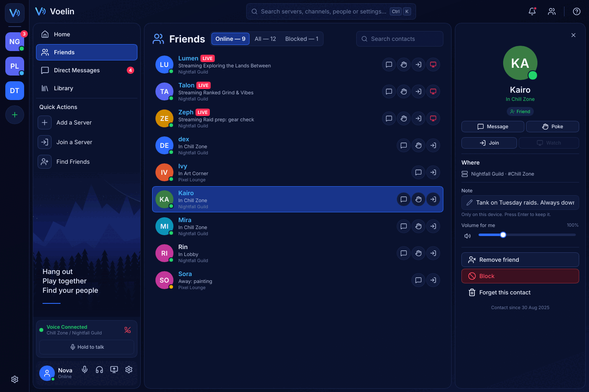 | 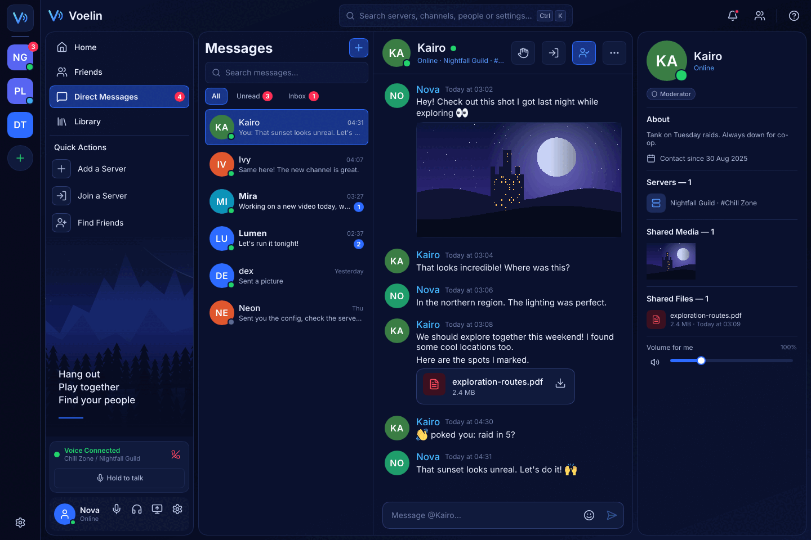 |
| 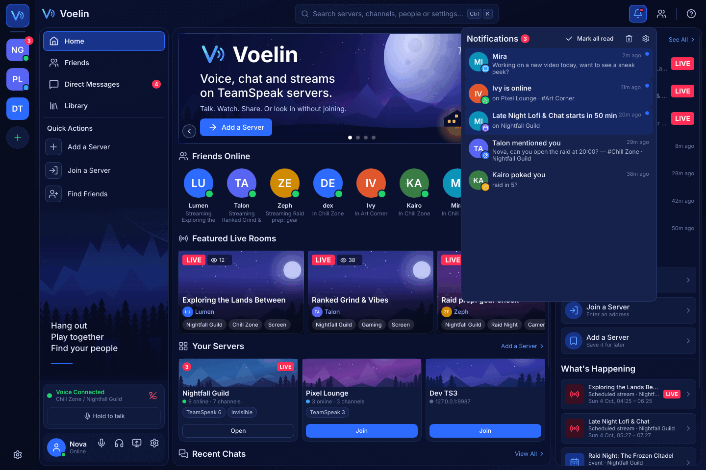 | 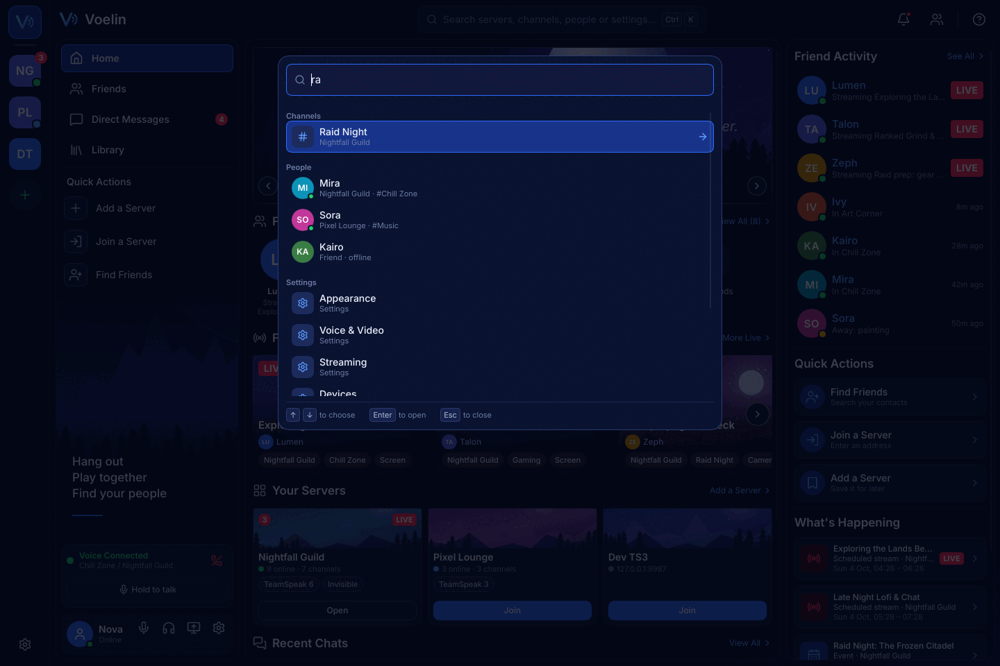 |
| 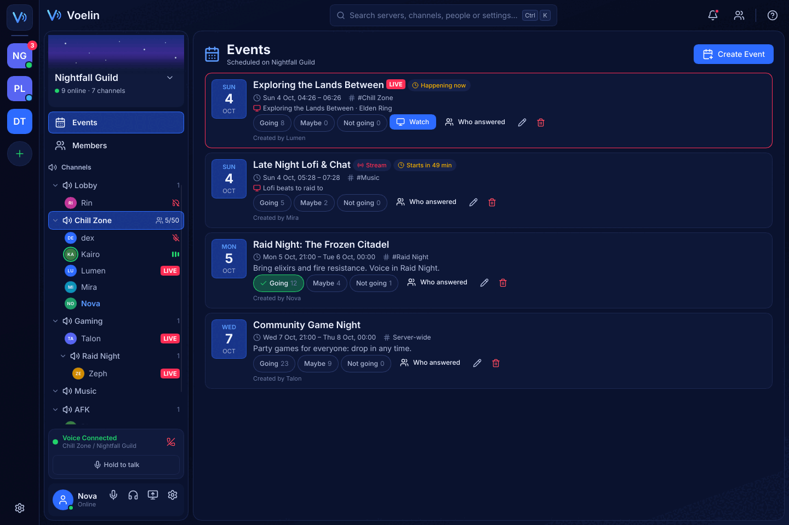 | 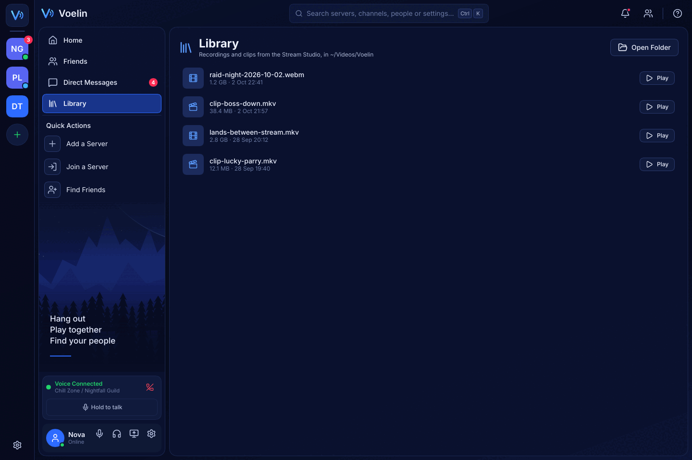 |
| 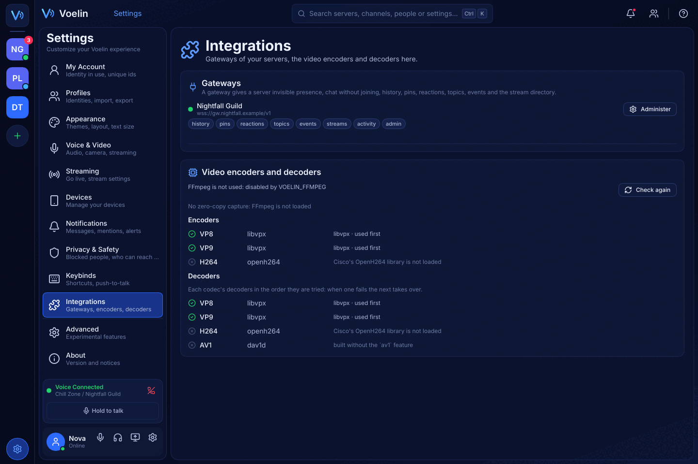 | 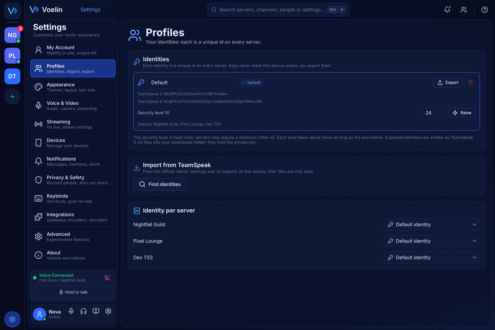 |

| Phone layout | | | | |
|---|---|---|---|---|
|  |  |  |  |  |
|  |  |  |  |  |
| 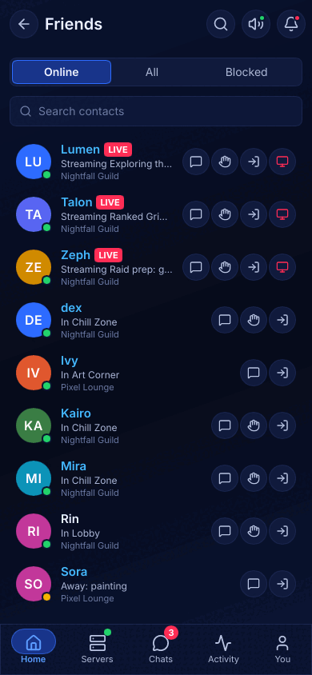 | 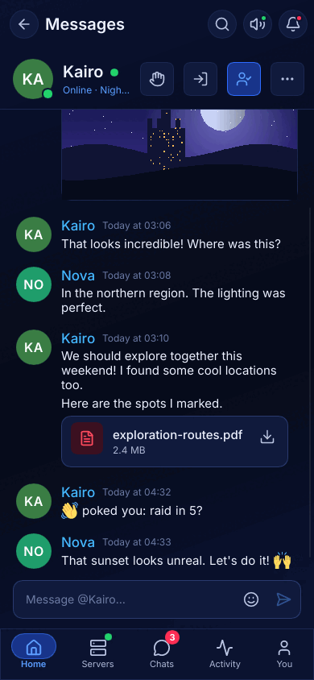 | 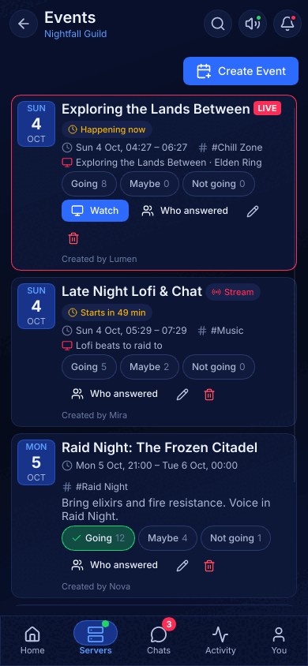 | 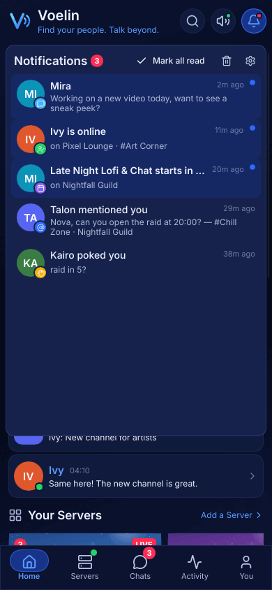 | 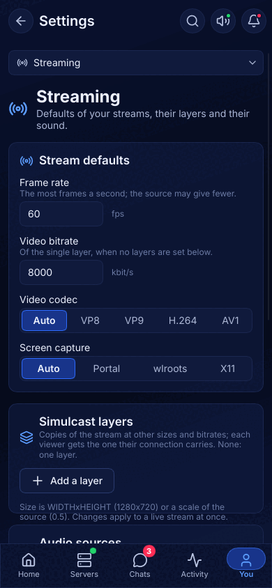 |
| 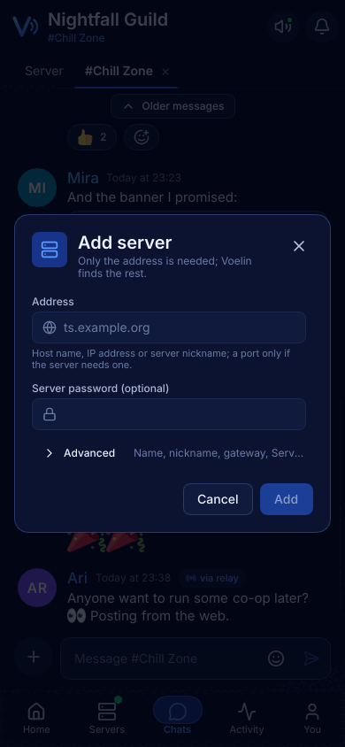 | | | | |

## Server and channel pictures

The compact server card shows its icon over the host banner. TeamSpeak 6
channel banners sit behind their titles in fixed-height tree rows (34 pixels),
and behind desktop and phone chat/voice headers. Artwork uses centred cover
cropping without distortion; it never adds height to navigation. Custom channel
icons lead the title. Top-level spacer channels show their text without the
prefix and without an icon or a member count: `[spacerN]` and `[lspacerN]` on
the left, `[cspacerN]` centred, `[rspacerN]` on the right, and `[*spacerN]---`
repeats its text across the row as a line (any text may follow `spacer`, as
it only keeps names unique). Every screen that names a channel, and the
Android voice notification, shows a spacer's text; the tree search, Ctrl+K and
the event form leave out lines and empty spacers. A theme-aware surface
gradient (74% to 66% opacity) keeps primary text above 4.5:1 contrast even on
all-white or all-black artwork, while leaving the image visible. Missing
pictures retain the normal background.

A channel has one icon everywhere, a speaker (`Icons.channel`, a lock for a
locked one in the tree), and chat tabs, notifications and search results name
it without a `#`. A server icon at most half as wide as its avatar (TeamSpeak's
are often 16 pixels) is drawn at twice its size, sharp, on the server's colour
instead of stretched. Avatars under 28 pixels, as the tree's clients, show one
letter.

Bookmarks remember the server icon ID and the address that supplied it. The
server list, search results and server header load its cached bytes before
connecting, including after restarting the app. Editing a server address
invalidates the association; queued details from the old address cannot replace
it. A missing or evicted image falls back to initials. This requires no
ServerQuery configuration and starts no background voice connection.

First-visit icon downloads before login remain unverified. On a private TS6
6.0.0-beta13.1 fixture, the native encrypted handshake completed without
`clientinit`, but pre-login `serverinfo`, `getserverinfo`, `servergetvariables`,
`ftinitdownload` and `ftgetchannelfilehttptoken scid=icons` probes each received
no response within three seconds. The installed official client's UI code
populates its bookmark icon cache from connected server properties. Its clean
profile requires account setup before the server list, so no fresh-profile
network capture was obtained. These observations do not establish that every
server or client version lacks a pre-login mechanism.

Badges arrive as GUIDs (`client_badges`; on TeamSpeak 6 also
`client_signed_badges`, the myTeamSpeak badges the server verified, which
come first: `voelin_model::shown_badges`). Their names and descriptions come
from a table in `voelin-model` (`badges::info`, tsclientlib's list and the
newer entries of TeamSpeak's own, `https://badges-content.teamspeak.com/list`,
as of October 2026); newer badges show as "Badge". Their pictures are SVGs
on TeamSpeak's server (`https://badges-content.teamspeak.com/<guid>/<filename>.svg`,
`badges::icon_url`), fetched like web banners for the first three badges of
each client in the presence shown, and reported with `PictureReady`. A
client's tree row shows the pictures that arrived right after the name (its
group and client icons stay at the end); so does its row in the members
panel.

The engine downloads banners and badges, and the pictures chat messages
show (`[img]`, `Command::FetchPicture`), only while `cache.fetch_images` is
enabled.
Banners on the web (`http`, `https`) come from their host; banners in the
server's own files, linked as `ts3image://` (TeamSpeak 5 and 6:
`ts3image://<host>?port=…&channel=…&path=…&filename=…`, the file browser's
`ts3file://` link with its scheme changed; TeamSpeak 3:
`ts3image://<name>?channel=…&path=…`), come through the voice connection's
file transfer, so they need voice and the server's file permissions. Their
cache entry is named by the server too, as the same address names another
file elsewhere. Up to 16 web downloads run at once, at most 6 per host (a
redirect's target counts); duplicate URLs share a request. Pictures on the
web go through the desktop's proxy (the portal's, on Linux) or the
system's, SOCKS too. A picture may be up to 128 MiB (avatars and icons
too; myTeamSpeak avatars 4 MiB, a chat's `[img]` up to
`ui.image_preview_kb`), and goes to disk as it arrives. Web downloads
connect within 20 seconds, and fail after 60 seconds without data or when,
after their first 120 seconds, they average less than 8 KiB/s; there is
no fixed overall deadline, so large banners on slow hosts still arrive.
Failed banners and badges are tried again after 1, 4, 16, 60, 300 and 900
seconds, then every 15 minutes while they are shown; one whose address is
wrong or gone (HTTP 400, 404, 410) after 15 minutes, then hourly; one whose
host asks to wait (429, 503) when it says (1 minute to 1 hour). Asked for
again, a cached picture is downloaded only if its host says it changed
(ETag, Last-Modified). Avatars, icons and chat pictures receive up to three
automatic retries after 1, 4 and 16 seconds. Retries do not wait for a
presence update. Avatar/icon/banner file-transfer negotiation expires
after 30 seconds, and the download after 60 seconds plus its size at
8 KiB/s. User file transfers retain their existing timing. Replaced images
and closed sessions discard obsolete results. A host banner's reload
interval is at least 60 seconds; failed refreshes preserve the previous
cached picture. Closing the session stops its reload timer.
`PictureReady` (and `AvatarReady`, `IconReady`) has a file that changed
decoded again before the visible models refresh, also when the URL and
cache path stay the same.

PNG, JPEG, GIF, WebP, BMP, ICO and SVG (also after a comment or DOCTYPE)
are decoded by content, since cached files have no extension. Raster
pictures whose decoded RGBA would exceed 128 MiB are refused before pixel
allocation on the UI thread; those larger than 4096 pixels on a side are
scaled down (an animation to its first frame). SVG uses Slint's vector
loader and the existing vector-cache cost.
Avatars and server, channel, client and group icons use the same image cache.

The focused checks are the `voelin-core`, `voelin-model`, `voelin-observer`,
`voelin-store` and `voelin-ui` library tests. They cover offline icon restoration,
bookmark compatibility, cache misses and old-address event rejection. The live
`ts6_banners` test checks disabled
fetching, recovery from HTTP 503 without another presence update, all three
modes, channel URL replacement and removal, and a fresh host download after
the 60-second interval. `ts6_avatars` uploads an avatar with one client and
verifies its bytes and MD5 after another client downloads it into an independent
cache. Both use
the development TS6 server by default; a private fixture can override its
endpoints without changing the other live tests:

```sh
VOELIN_LIVE=1 \
VOELIN_BANNER_VOICE_ADDR=127.0.0.1:19988 \
VOELIN_BANNER_QUERY_ADDR=127.0.0.1:20022 \
cargo test --locked -p voelin-core --test live ts6_banners -- --exact
```

The 2026-10-04 follow-up passed all 200 focused library tests. The download
checks passed both live scenarios against a private
TS6 6.0.0-beta13.1 instance, including its real reload interval. The compact
layout passed seven headless screenshot scenarios. These screenshots use
sample data on Xvfb with Slint's software
renderer; the phone layouts are desktop renders, not Android device tests.

| Desktop | Phone layout |
|---|---|
| 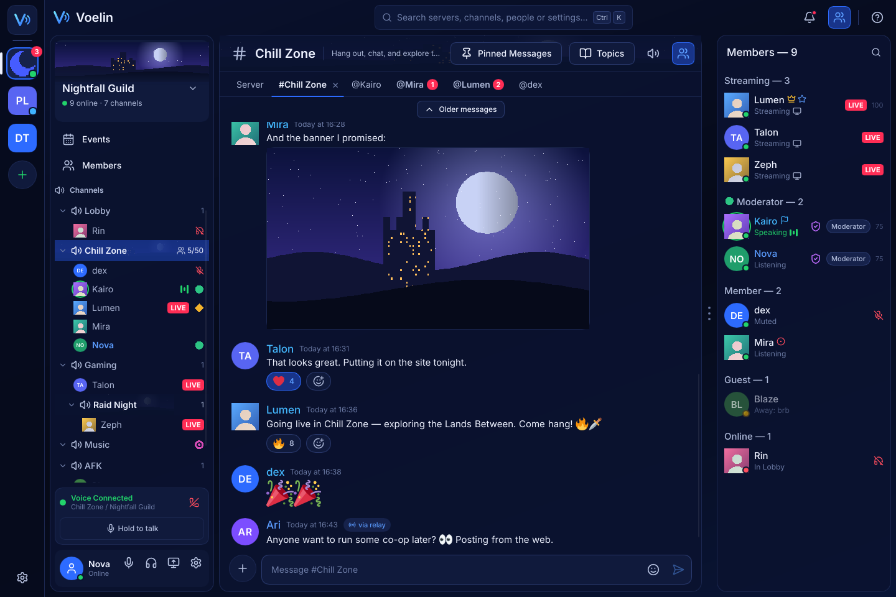 | 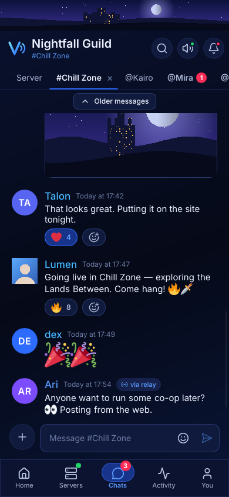 |
| 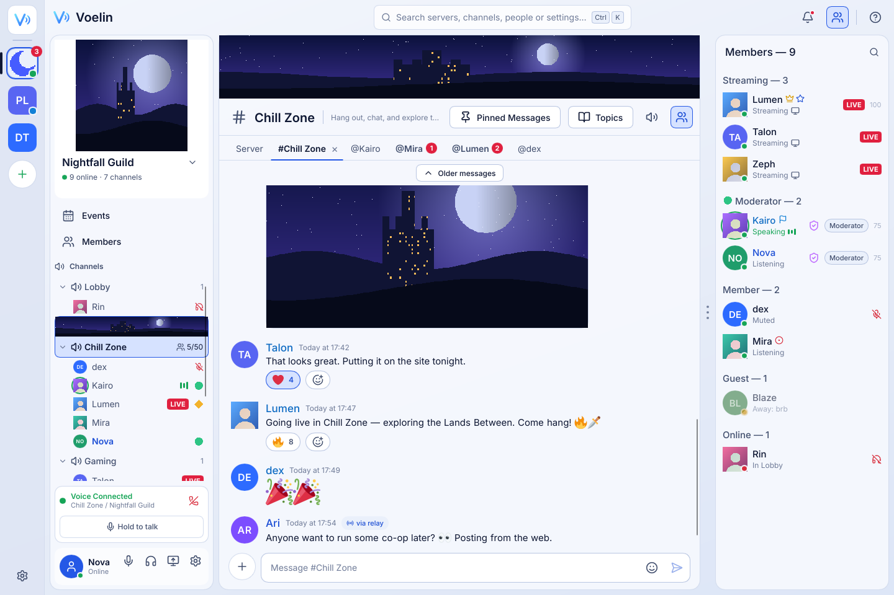 | 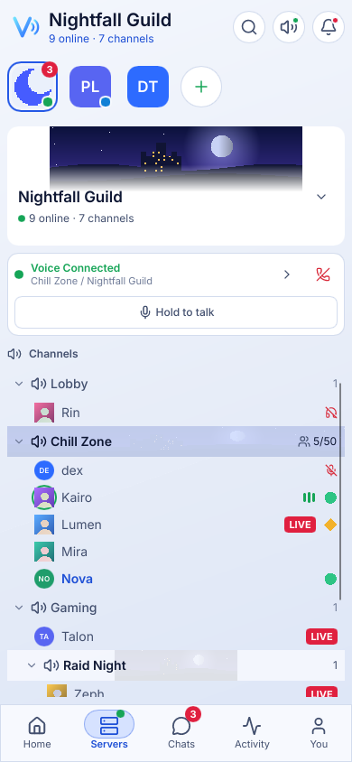 |
| 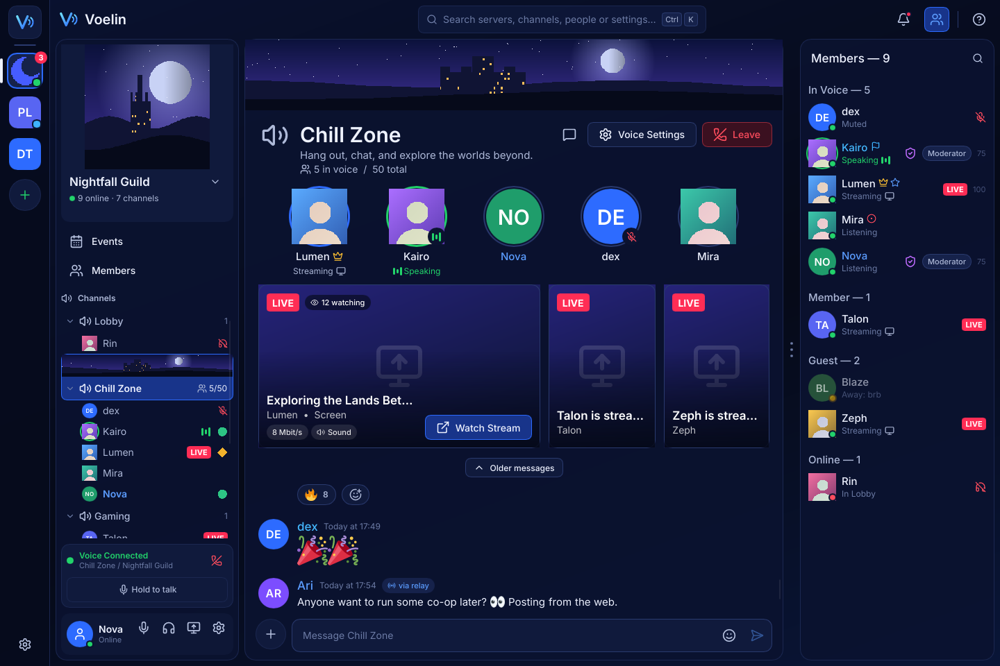 | 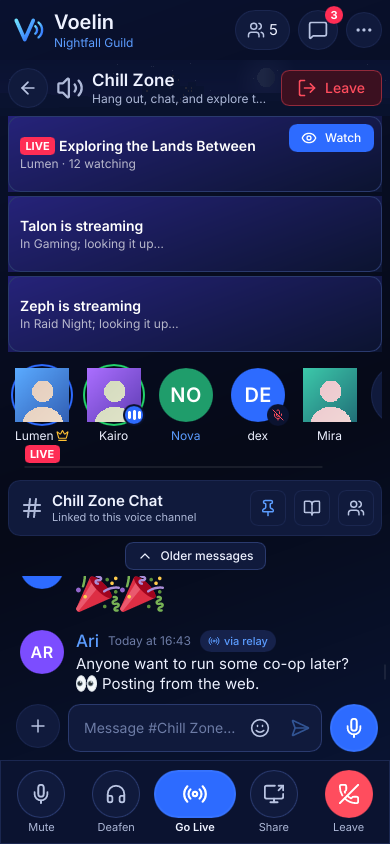 |

## Limits

- No drop shadows or blur (the software renderer draws none): glows are
  translucent rings, the backdrop is a gradient rectangle.
- Avatars are the clients' pictures from the engine's cache
  (`AvatarReady`), or initials on a colour from the name; group icons come
  from `IconReady`.
- The members panel lists the people online: TeamSpeak tells a client
  nothing about offline members, so the mockup's "Offline" section and a
  server-wide member count are left out.
- The quality picker shows only when the streamer lists its simulcast
  layers, which only a Voelin streamer does (`a=x-voelin-layers`, see
  [media.md](media.md)); for the official client's streams the player
  shows the decoded picture's height.
- Popping the stream out fills the main window (no second window yet).
- A jump to a pinned message scrolls to where an average row would be
  (rows differ in height), and only to messages already loaded. So does
  the unread bar's Jump, and the bar shows while that estimate of the New
  line is above the view.
- What is read stays on this device: TeamSpeak has no read receipts. The
  window's focus is known on the desktop (winit); on Android a chat on
  screen counts as read.
- The window keeps its native decorations (no custom title bar).
- The Stream Studio streams to the voice channel we are in (a TeamSpeak 6
  stream belongs to its channel): its destination picks among the servers,
  not among their channels. Image paths (image sources, backgrounds) are
  typed, there is no file chooser. The background effect replaces what is
  around the person the engine's segmentation model finds (an oval where
  the model does not load). The
  studio cannot be detached on Android (one window). Its own window shows
  no toasts; status messages go to the main window.
- Home, friends and messages show what the user's servers tell: there is
  no global network behind TeamSpeak, so the design's Discover, other
  communities with member counts, the games friends play and the upgrade
  panels are left out, and a friend shows as online only on servers we
  are on or look into.
- Direct messages need a voice connection to the peer's server; the
  design's calls, groups, requests, voice messages and reactions in
  private chats have no TeamSpeak counterpart.
- On the phone the settings are a list on the You tab and a section
  picker inside them, not the design's list beside the page (too narrow
  for most sections at a phone's width).
